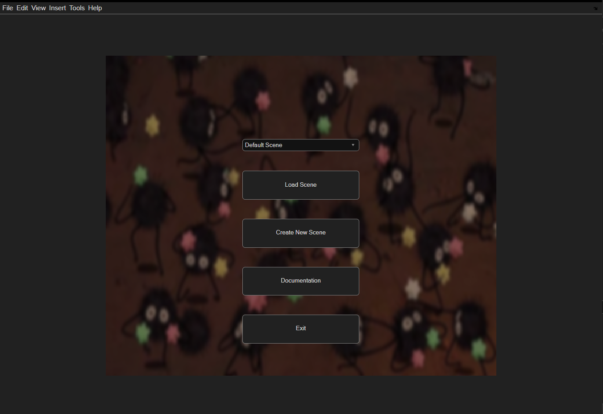
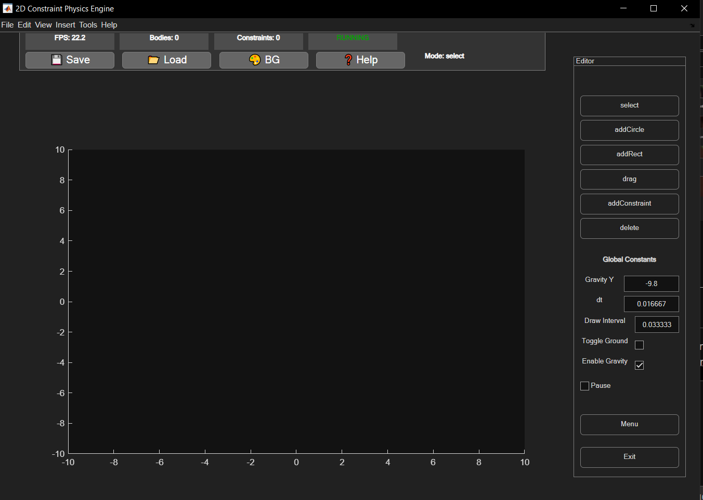
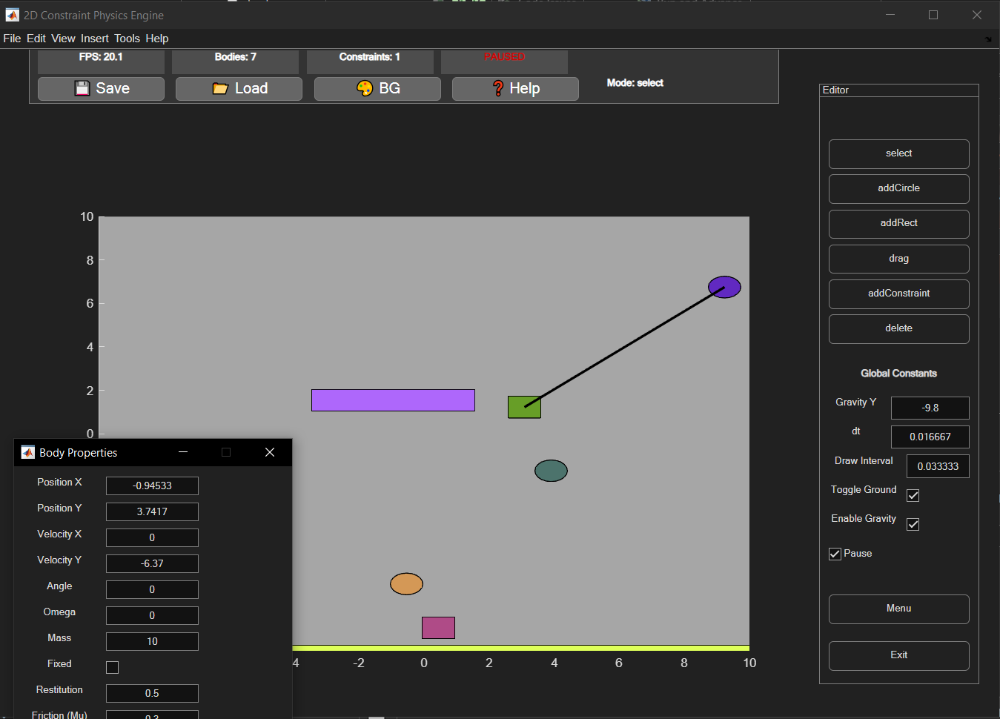

# MATLAB 2D Physics Engine with Editor

A rigid body 2D physics engine implemented in **MATLAB R2025b**, featuring a full editor and GUI for creating, modifying, and simulating scenes. The project provides an interactive environment to experiment with bodies, constraints, and real-time physics simulation.

---

## Overview

This project simulates 2D rigid body dynamics with collisions, friction, and constraints. It is structured in a standard engine architecture:

- **Core/** – Contains the physics engine: `Core.m`, `Body.m`, `Scene.m`, `Constraint.m`.  
- **App/** – GUI and editor classes: `Editor.m`, `ConstraintEngine.m`.  
- **Utils/** – Physics utilities: SAT collision detection, contact point generation.  
- **Assets/** – Images and backgrounds. The menu background (`background.png`) is customizable.  
- **Scenes/** – Saved scene files (`.mat`).  
- **Docs/** – Includes `helper.html` for in-app help; other documentation is generated by the user.

To run the engine, simply open **MATLAB R2025b**, navigate to the project folder, add everything to path, and execute:

```matlab
main.m
```

---

## Menu & UI Features

Upon starting, the engine opens a menu with a background image and 4 main buttons:

1. **Load Scene** – Load a scene from `scenes/` or the default in-memory scene.  
2. **Create New Scene** – Opens an empty scene (unsaved).  
3. **Documentation** – Generates project docs in HTML and PDF using MATLAB's `publish` and opens a selection popup to view classes.  
4. **Exit** – Closes the application.  

The background image is located at `assets/background.png` and can be replaced by the user.

---

## Editor & Simulation Interface

Once a scene is open, the main editor includes:

- **Viewing area** – Displays all bodies and constraints.  
- **Axes** – Bottom-left viewport for reference.  
- **Toolbar** – Top panel showing:
  - FPS
  - Body count
  - Constraint count
  - Simulation running status
  - Mode hint (e.g., `"Mode: drag"`)  
  - Buttons: Load Scene, Save Scene (to `/scenes`), Background color picker, Help tooltip (opens `docs/helper.html`)  

- **Mode Panel** – Right-hand side, allows selection of modes:
  - `select` – Click a body or constraint to open the property panel.  
  - `addCircles` / `addRect` – Add new bodies.  
  - `drag` – Move bodies interactively.  
  - `addConstraint` – Click-and-drag from one body to another to bind them.  
  - `delete` – Remove selected objects.  

- **Global Controls**:
  - Time step (`dt = 1/60`)  
  - Draw interval (`DrawInterval = 1/30`)  
  - Gravity (`GravityY = -9.8`)  
  - Checkboxes:
    - Toggle ground (adds a large static rectangle)  
    - Enable gravity  
    - Pause simulation  
  - Menu and Exit buttons  

### Shortcuts

Shortcuts are documented in the in-app help (`docs/helper.html`). Key highlights:

- `c` – Add circle  
- `r` – Add rectangle  
- `d` – Toggle drag mode  
- `q` – Delete or reset scene  
- `Esc` – Close popup or menu  
- `M` – Open menu  
- `Space` – Pause simulation  
- `K` – Add constraint  
- `G` – Toggle ground  

Mouse controls:

- Middle-click drag for instant movement  
- Right-click to select and edit properties  
- Left-click for normal interactions  

---

## Body & Constraint Properties

### Bodies

Bodies have editable properties in the property panel:

- Position (`x`, `y`)  
- Velocity (`vx`, `vy`)  
- Angle & angular velocity (`omega`)  
- Mass & fixed toggle  
- Restitution & friction coefficient (`mu`)  
- Shape type hint, width/height for rectangles, radius for circles  
- Color picker  

### Constraints

Constraints connect two bodies and expose:

- Connected bodies hints  
- Rest length  
- Stiffness  

### Hidden Mechanics

- Bodies falling out of the viewport for too long are automatically destroyed to save MATLAB rendering resources.

---

## Behind the Scenes

The engine features:

- **Sequential Impulse Solver** for collision resolution  
- **SAT (Separating Axis Theorem) collision detection**  
- **Contact points & manifolds** generation based on [Tim Wheeler's approach](https://timallanwheeler.com/blog/2024/08/01/2d-collision-detection-and-resolution/)  
- Support for stacking, corner stability, and realistic friction/rotation  

It is theoretically capable of handling soft-body setups like cloth using constraints and circular bodies, though MATLAB performance limits practical use.

---

## Customization & Tips

- Replace `assets/background.png` to change the menu background.  
- Save and load scenes to/from the `scenes/` folder.  
- Use `docs/helper.html` to view all shortcuts and tooltips.  
- Generated documentation is created in the project folder with MATLAB's `publish` function.

---

## Screenshots

 **Menu and Editor Interface**  









---

## Notes

- This is a **university-level project** intended for demonstration and exploration.  
- Bugs may exist; performance depends on MATLAB rendering limits.  
- Inspired by C++ physics engine design patterns, adapted for MATLAB.  

